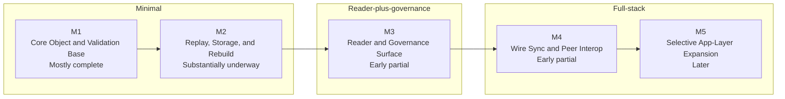

# Mycel Progress View

Status: draft, refreshed after the recent canonical-helper convergence, peer-store sync-driver, CLI peer-sync, simulator integration, and optional-flow sync coverage batch

This page turns [`ROADMAP.md`](../ROADMAP.md) and [`IMPLEMENTATION-CHECKLIST.en.md`](../IMPLEMENTATION-CHECKLIST.en.md) into one quick progress view.

## Current Lane

The current build lane is:

1. close `M1` parsing and canonicalization debt
2. finish `M2` replay, rebuild, and merge-authoring closure
3. expand `M3` reader workflows carefully on top of the now-usable accepted-head inspection, render, and editor-admission-aware profile base while defining any bounded viewer-in-selector follow-up explicitly instead of leaving it as implicit design debt
4. keep `M4` narrow while peer-store sync proof grows toward broader interop closure and future production replication behavior

## Milestone Timeline

## Milestone Snapshot

| Milestone | Status | Main focus now | Main gaps |
|---|---|---|---|
| `M1` | Mostly complete | shared parsing, canonical helpers, and stricter parser/replay/CLI proof coverage | malformed field-shape depth closure, remaining semantic-edge closure, final wire-path helper convergence, milestone-close proof points |
| `M2` | Substantially underway | replay, `state_hash`, store rebuild, ancestry-aware render/store verification, narrow write path, and conservative merge authoring with broader structural coverage | stronger replay/store fixtures, broader core reuse, and richer nested/reparenting conflict classification |
| `M3` | Early partial | accepted-head reader workflows, bundle/store rendering with clearer ancestry context, named fixed-profile reading, editor-admission-aware inspect/render flows, initial filtered/sorted/projected `view` governance inspect/list/publish workflows, and persisted reverse governance indexes | broader governance persistence, richer governance tooling, reader profile ergonomics, and bounded viewer-in-selector governance follow-up |
| `M4` | Early partial | wire envelope validation, `OBJECT` body verification, session reachability, store-backed bootstrap, peer-store-driven first-time / incremental sync proofs, and capability-gated optional-message handling | broader peer interop proof and production replication behavior remain |
| `M5` | Later | selective app-layer growth | depends on stable protocol core and sync |

## Implementation Matrix

Legend:

- `Done`: current checklist section is substantially closed for the minimal client
- `Mostly done`: only closure or follow-up work remains
- `Partial`: meaningful implementation exists, but the section is not closeable yet
- `Not started`: still mostly future work

| Area | Status | Primary milestone | Current read |
|---|---|---|---|
| 1. Repo and Build Setup | Mostly done | `M1` | the build/test base is stable, and shared canonical helper ownership is converging on a dedicated core module; the remaining utility closure is mostly in wire-path reuse |
| 2. Object Types and IDs | Partial | `M1` | all required v0.1 families are typed, and parser / verify / CLI dependency-proof coverage is broader; malformed field-shape depth, remaining semantic-edge closure, and role modeling remain |
| 3. Canonical Serialization and Hashing | Partial | `M1` | core rules and reproducibility coverage exist, and canonical helper ownership is more centralized in a shared core module; the remaining closure is the wire-path canonicalization follow-up rather than replay-derived `state_hash` |
| 4. Signature Verification | Partial | `M1` / `M4` | object signature rules are in place, generic wire-envelope signature verification exists, replay-derived `state_hash` now uses the shared helper path, `OBJECT` body hash / `object_id` recomputation runs in wire validation, and capability-gated optional messages are enforced; remaining closure is the broader wire follow-up and wider peer interop proof |
| 5. Patch and Revision Engine | Mostly done | `M2` | replay and `state_hash` are in place; dependency verification, wrong-type and multi-hop ancestry proofs, sibling declared-ID determinism, and render-path ancestry context are stronger |
| 6. Local State and Storage | Mostly done | `M2` | store ingest, rebuild, and indexes exist; rebuild smoke now preserves nested ancestry context in summary reporting, but local transport/safety separation remains |
| 7. Wire Protocol | Partial | `M4` | canonical wire-envelope parsing, field validation, RFC 3339 checks, minimal-message payload validation, sender checks, session sequencing/head tracking, reachability gating, store-backed bootstrap, `OBJECT` body verification, capability-gated optional-message handling, and a minimal peer-store sync driver now exist in `mycel-core`; broader peer interop remains |
| 8. Sync Workflow | Partial | `M4` | peer-store-driven first-time and incremental sync now prove shared verify/store flows through `mycel-core`, the CLI, and simulator positive-path coverage, including snapshot-assisted catch-up and announced-view fetching; broader peer interop proof and production replication behavior remain open |
| 9. Views and Head Selection | Mostly done | `M3` | deterministic selector core, named fixed-profile selection, and editor-admission-aware inspect/render flows exist; dual-role closure remains, and any bounded viewer-in-selector extension is now an explicit follow-up instead of hidden future debt |
| 10. Merge Generation | Partial | `M2` | replay verification and a conservative local merge-authoring profile exist, including structural move/reorder, new-parent reparenting, simple composed parent-chain coverage, and a broader nested structural matrix, but richer nested/reparenting conflict cases still fall back to manual curation |
| 11. CLI or API Surface | Partial | `M2` / `M3` / `M4` | verification, authoring, conservative merge authoring, editor-admission-aware reader inspection/render, governance inspect/list/publish, persisted governance index query surfaces, transcript-backed `sync pull`, and internal `sync peer-store` all exist, including optional snapshot/view flows; broader replication behavior remains open |
| 12. Interop Test Minimum | Partial | `M1` / `M2` / `M4` | fixture isolation, reproducibility, stricter parser/replay smoke coverage, direct wire-envelope/signature/session tests, peer-store first-time / incremental sync proofs, optional-message coverage, and simulator positive-path coverage exist, but broader peer-interop cases remain |
| 13. Ready-to-Build Gate | Partial | whole plan | replay, head selection, rebuild, conservative merge authoring, and peer-store sync proofs are green; parse closure, broader peer interop, and production replication behavior are not |

## Suggested Reading Path

1. Read [`ROADMAP.md`](../ROADMAP.md) for build order and milestone intent.
2. Read [`IMPLEMENTATION-CHECKLIST.en.md`](../IMPLEMENTATION-CHECKLIST.en.md) for section-by-section closure items.
3. Read [`DEV-SETUP.md`](./DEV-SETUP.md) if you are starting from a fresh environment or onboarding a new agent.
4. Use [`progress.html`](../pages/progress.html) for the public visual summary.
