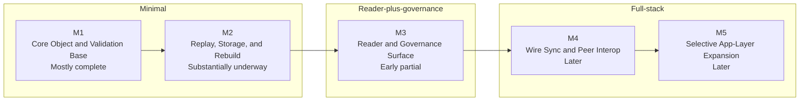

# Mycel Progress View

Status: draft, refreshed after the recent M2 authoring and M3 accepted-head render/profile-selection batch

This page turns [`ROADMAP.md`](../ROADMAP.md) and [`IMPLEMENTATION-CHECKLIST.en.md`](../IMPLEMENTATION-CHECKLIST.en.md) into one quick progress view.

## Current Lane

The current build lane is:

1. close `M1` parsing and canonicalization debt
2. finish `M2` replay, rebuild, and merge-authoring closure
3. expand `M3` reader workflows carefully on top of the now-usable accepted-head inspection and render base

## Milestone Timeline

## Milestone Snapshot

| Milestone | Status | Main focus now | Main gaps |
|---|---|---|---|
| `M1` | Mostly complete | shared parsing, canonical helpers, strictness/fixture coverage | malformed field-shape depth closure, shared canonical utility reuse, milestone-close proof points |
| `M2` | Substantially underway | replay, `state_hash`, store rebuild, persisted indexes, narrow write path | merge authoring, stronger replay/store fixtures, broader core reuse |
| `M3` | Early partial | accepted-head reader workflows, bundle/store rendering, named fixed-profile reading, initial filtered/sorted/projected `view` governance inspect/list/publish workflows | broader governance persistence, richer governance tooling, reader profile ergonomics |
| `M4` | Later | wire envelope, sync workflow, peer interop | depends on stable reader and store model |
| `M5` | Later | selective app-layer growth | depends on stable protocol core and sync |

## Implementation Matrix

Legend:

- `Done`: current checklist section is substantially closed for the minimal client
- `Mostly done`: only closure or follow-up work remains
- `Partial`: meaningful implementation exists, but the section is not closeable yet
- `Not started`: still mostly future work

| Area | Status | Primary milestone | Current read |
|---|---|---|---|
| 1. Repo and Build Setup | Mostly done | `M1` | only the shared canonical JSON utility remains open |
| 2. Object Types and IDs | Partial | `M1` | typed parsing exists for all required v0.1 families; remaining work is malformed field-shape depth, semantic-edge closure, and role modeling |
| 3. Canonical Serialization and Hashing | Partial | `M1` | core rules and reproducibility coverage exist; shared canonical utility reuse for `state_hash` and wire remains open |
| 4. Signature Verification | Partial | `M1` | object signature rules are mostly present, and signature-edge verify smoke coverage is broader; wire-envelope checks are not |
| 5. Patch and Revision Engine | Mostly done | `M2` | replay and `state_hash` are in place; patch-op base is strong |
| 6. Local State and Storage | Mostly done | `M2` | store ingest, rebuild, and indexes exist; local transport/safety separation remains |
| 7. Wire Protocol | Not started | `M4` | canonical wire envelope and message validation are still future work |
| 8. Sync Workflow | Not started | `M4` | first-time and incremental sync remain future work |
| 9. Views and Head Selection | Mostly done | `M3` | deterministic selector core and named fixed-profile selection exist; dual-role closure remains |
| 10. Merge Generation | Partial | `M2` | verification is replay-based, but local merge authoring is not built |
| 11. CLI or API Surface | Partial | `M2` / `M3` | verification, authoring, reader inspection/render, and initial governance inspect/list/publish with filtered/projected listing exist; sync remains open |
| 12. Interop Test Minimum | Partial | `M1` / `M2` | fixture isolation, reproducibility, and smoke coverage exist, but several normative wire and replay checks remain |
| 13. Ready-to-Build Gate | Partial | whole plan | replay, head selection, and rebuild are green; parse, wire sync, and merge generation are not |

## Suggested Reading Path

1. Read [`ROADMAP.md`](../ROADMAP.md) for build order and milestone intent.
2. Read [`IMPLEMENTATION-CHECKLIST.en.md`](../IMPLEMENTATION-CHECKLIST.en.md) for section-by-section closure items.
3. Read [`DEV-SETUP.md`](./DEV-SETUP.md) if you are starting from a fresh environment or onboarding a new agent.
4. Use [`progress.html`](./progress.html) for the public visual summary.
