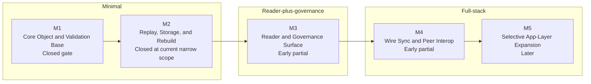

# Mycel Progress View

Status: draft, refreshed for a planning-sync pass so the summary now reflects `M3` / `M4` as the active planning lane; `M2` replay/storage/rebuild closure is now landed at the current narrow scope after the richer mixed branch kinds, the multi-document rebuild-after-index-loss proof, and the richer metadata multi-variant rebuild/reporting proof all landed, `M3` still centers on broader governance persistence, richer governance tooling, reader profile ergonomics, and final dual-role closure beyond the current inspect/list/publish plus current-governance-summary baseline, and `M4` now records localhost transport proof, all three currently tracked production replication sub-proofs, capability-gated optional-message rejection, broader pre-`HELLO` / pre-root session rejection, `HEADS`-before-`MANIFEST` sync-root setup, stale root/dependency rejection after `HEADS replace=true`, unknown-sender and HELLO sender-identity mismatch rejection, explicit `ERROR`-only transcript failure, unreachable `WANT` revision/object rejection, and permanent messages-after-BYE proof as landed while broader session/capability/error-path interop remains open

This page turns [`ROADMAP.md`](../ROADMAP.md) and [`IMPLEMENTATION-CHECKLIST.en.md`](../IMPLEMENTATION-CHECKLIST.en.md) into one quick progress view.

## Current Lane

The current build lane is:

1. keep `M2` closed at the current narrow replay/storage/rebuild scope while later work grows around it
2. expand `M3` reader-plus-governance workflows carefully on top of the now-usable accepted-head inspection, render, clearer available-profile and profile-error feedback, editor-admission-aware profile base, bounded viewer score surfaces, initial governance inspect/list/publish surfaces, persisted governance relationship summaries exposed through `view inspect` / `view list`, and per-document current-governance summaries exposed through `view current` while keeping broader governance persistence, richer governance tooling beyond this initial base, profile ergonomics beyond this initial polish, and final independent dual-role role-assignment closure explicit
3. keep `M4` narrow while peer-store sync proof grows toward the remaining session/capability/error-path interop closure now that the current production replication sub-items, capability-gated optional-message rejection, broader pre-`HELLO` / pre-root gating proofs, `HEADS`-before-`MANIFEST` sync-root setup, stale root/dependency rejection after `HEADS replace=true`, unknown-sender and HELLO sender-identity mismatch rejection, explicit `ERROR`-only transcript failure, unreachable `WANT` revision/object rejection, and a permanent messages-after-BYE proof all exist

## Milestone Timeline

## Milestone Snapshot

| Milestone | Status | Main focus now | Main gaps |
|---|---|---|---|
| `M1` | Closed gate | minimal-client proof retained as a completed checklist section | no longer the active lane; follow-up work moved into `M2` / `M3` / `M4` tracking |
| `M2` | Closed at current narrow scope | replay, `state_hash`, store rebuild, ancestry-aware render/store verification, explicit CLI proof that multi-document indexes rebuild cleanly after index loss from stored canonical objects, narrow write path, conservative merge authoring with broader structural coverage plus manual-curation smoke for nested parent-choice, nested sibling-choice, and composed-branch placement conflicts, richer direct and anchor-based competing placement reasons, richer mixed content/metadata competing-branch classification with matching CLI smoke coverage, and rebuild-after-index-loss proof for the richer metadata multi-variant merge case | no remaining narrow-scope closure gaps; future follow-up can stay outside active `M2` debt |
| `M3` | Early partial | accepted-head reader workflows, bundle/store rendering with clearer ancestry context, named fixed-profile reading with clearer available-profile and profile-error feedback, editor-admission-aware inspect/render flows, distinct human/debug head text modes, bounded viewer score surfaces in head inspection, initial filtered/sorted/projected `view` governance inspect/list/publish workflows, persisted reverse governance indexes, persisted governance relationship summaries exposed through `view inspect` / `view list`, and per-document current-governance summaries exposed through `view current` | broader governance persistence, richer governance tooling, reader profile ergonomics beyond this initial polish, and final independent dual-role role-assignment closure |
| `M4` | Early partial | wire envelope validation, `OBJECT` body verification, session reachability, store-backed bootstrap, peer-store-driven first-time / incremental sync proofs, capability-gated optional-message handling plus missing-capability rejection, localhost multi-process proof, re-sync idempotency proof, depth-N incremental catchup proof, partial-doc selective sync proof, broader pre-`HELLO` / pre-root session rejection, `HEADS`-before-`MANIFEST` sync-root setup, stale root/dependency rejection after `HEADS replace=true`, unknown-sender and HELLO sender-identity mismatch rejection, explicit `ERROR`-only transcript failure, unreachable `WANT` revision/object rejection, and a messages-after-BYE simulator proof | remaining broader session/capability/error-path interop coverage such as advertised-root/root-set violations and other post-`HELLO` protocol-state faults |
| `M5` | Later | selective app-layer growth | depends on stable protocol core and sync |

## Implementation Matrix

Legend:

- `Done`: current checklist section is substantially closed for the minimal client
- `Mostly done`: only closure or follow-up work remains
- `Partial`: meaningful implementation exists, but the section is not closeable yet
- `Not started`: still mostly future work

| Area | Status | Primary milestone | Current read |
|---|---|---|---|
| 1. Repo and Build Setup | Done | `M1` | this is now part of the closed minimal-client gate; no active follow-up remains here |
| 2. Object Types and IDs | Done | `M1` | the required v0.1 families and minimal-client role modeling are now retained as closed gate proof, not active checklist debt |
| 3. Canonical Serialization and Hashing | Done | `M1` | canonical rules and shared helper reuse needed for the minimal gate are closed; post-`M1` wire follow-up now belongs to the broader `M4` lane rather than this gate |
| 4. Signature Verification | Done | `M1` / `M4` | minimal object and wire signature verification are closed for the gate; broader interop/error-path follow-up remains in `M4` |
| 5. Patch and Revision Engine | Mostly done | `M2` | replay and `state_hash` are in place; dependency verification, wrong-type and multi-hop ancestry proofs, sibling declared-ID determinism, and render-path ancestry context are stronger |
| 6. Local State and Storage | Mostly done | `M2` | store ingest, rebuild, indexes, and explicit CLI proof that multi-document indexes recover after index loss from stored canonical objects all exist; local transport/safety policy now persists in a separate local policy file while rebuild smoke preserves both replicated indexes and local policy state |
| 7. Wire Protocol | Partial | `M4` | canonical wire-envelope parsing, field validation, RFC 3339 checks, minimal-message payload validation, sender checks, session sequencing/head-tracking, reachability gating, store-backed bootstrap, `OBJECT` body verification, capability-gated optional-message handling plus missing-capability rejection, broader pre-`HELLO` and pre-root rejection, `HEADS`-before-`MANIFEST` sync-root setup, stale root/dependency rejection after `HEADS replace=true`, unknown-sender and HELLO sender-identity mismatch rejection, explicit `ERROR`-only transcript failure, unreachable `WANT` revision/object rejection, a messages-after-BYE simulator proof, and a minimal peer-store sync driver now exist in `mycel-core`; the main remaining interop work is broader session/capability/error-path proof |
| 8. Sync Workflow | Partial | `M4` | peer-store-driven first-time and incremental sync now prove shared verify/store flows through `mycel-core`, the CLI, and simulator positive-path coverage, including snapshot-assisted catch-up, announced-view fetching, localhost multi-process transport proof, re-sync idempotency, depth-N incremental catchup, partial-doc selective sync, missing-capability rejection, broader pre-`HELLO` / pre-root session gating, `HEADS`-before-`MANIFEST` sync-root setup, stale root/dependency rejection after `HEADS replace=true`, unknown-sender and HELLO sender-identity mismatch rejection, explicit `ERROR`-only transcript failure, unreachable `WANT` revision/object rejection, and messages-after-BYE rejection; remaining work is broader session/capability/error-path proof |
| 9. Views and Head Selection | Mostly done | `M3` | deterministic selector core, named fixed-profile selection with clearer available-profile summaries and profile-error feedback, separate editor/view admission-aware inspect/render flows, distinct human/debug head text modes, bounded viewer score channels in head inspection, persisted governance relationship summaries through `view inspect` / `view list`, and per-document current-governance summaries through `view current` exist; broader governance persistence, richer governance tooling, reader profile ergonomics beyond this initial polish, and final independent dual-role role-assignment closure remain |
| 10. Merge Generation | Partial | `M2` | replay verification and a conservative local merge-authoring profile exist, including structural move/reorder, new-parent reparenting, simple composed parent-chain coverage, a broader nested structural matrix, manual-curation smoke for nested parent-choice, nested sibling-choice, and composed-branch placement conflicts, richer direct/anchor-based competing placement reasons, landed metadata competing-variant handling for adopting or keeping primary over non-primary metadata additions, richer mixed content/metadata competing-branch detail with matching CLI smoke coverage, and an explicit manual-curation boundary for metadata removal because v0.1 patch ops do not yet express deletion; the current narrow `M2` closure is now landed, so future merge-authoring expansion is no longer active `M2` debt |
| 11. CLI or API Surface | Partial | `M2` / `M3` / `M4` | verification, authoring, conservative merge authoring, editor-admission-aware reader inspection/render, governance inspect/list/publish/current, persisted governance index query surfaces, persisted governance relationship summaries in `view inspect` / `view list`, transcript-backed `sync pull`, and internal `sync peer-store` all exist, including optional snapshot/view flows, localhost multi-process proof, re-sync idempotency, depth-N catchup, partial-doc selective sync, missing-capability rejection, broader pre-`HELLO` / pre-root session gating, `HEADS`-before-`MANIFEST` sync-root setup, stale root/dependency rejection after `HEADS replace=true`, unknown-sender and HELLO sender-identity mismatch rejection, explicit `ERROR`-only transcript failure, unreachable `WANT` revision/object rejection, and messages-after-BYE rejection; the remaining `M4` gap is broader session/capability/error-path interop proof |
| 12. Interop Test Minimum | Partial | `M1` / `M2` / `M4` | fixture isolation, reproducibility, stricter parser/replay smoke coverage, direct wire-envelope/signature/session tests, peer-store first-time / incremental sync proofs, optional-message coverage, localhost multi-process proof, re-sync idempotency coverage, depth-N incremental catchup coverage, partial-doc selective sync coverage, broader pre-`HELLO` / pre-root rejection coverage, `HEADS`-before-`MANIFEST` sync-root setup coverage, stale root/dependency rejection after `HEADS replace=true` coverage, unknown-sender and HELLO sender-identity mismatch coverage, explicit `ERROR`-only transcript coverage, unreachable `WANT` revision/object coverage, and messages-after-BYE coverage exist, but broader session/capability/error-path cases are still open |
| 13. Ready-to-Build Gate | Done | `M1` | the minimal-client gate is closed; remaining work now lives in the post-`M1` follow-up checklist instead of this gate |

## Suggested Reading Path

1. Read [`ROADMAP.md`](../ROADMAP.md) for build order and milestone intent.
2. Read [`IMPLEMENTATION-CHECKLIST.en.md`](../IMPLEMENTATION-CHECKLIST.en.md) for section-by-section closure items.
3. Read [`DEV-SETUP.md`](./DEV-SETUP.md) if you are starting from a fresh environment or onboarding a new agent.
4. Use [`progress.html`](../pages/progress.html) for the public visual summary.
